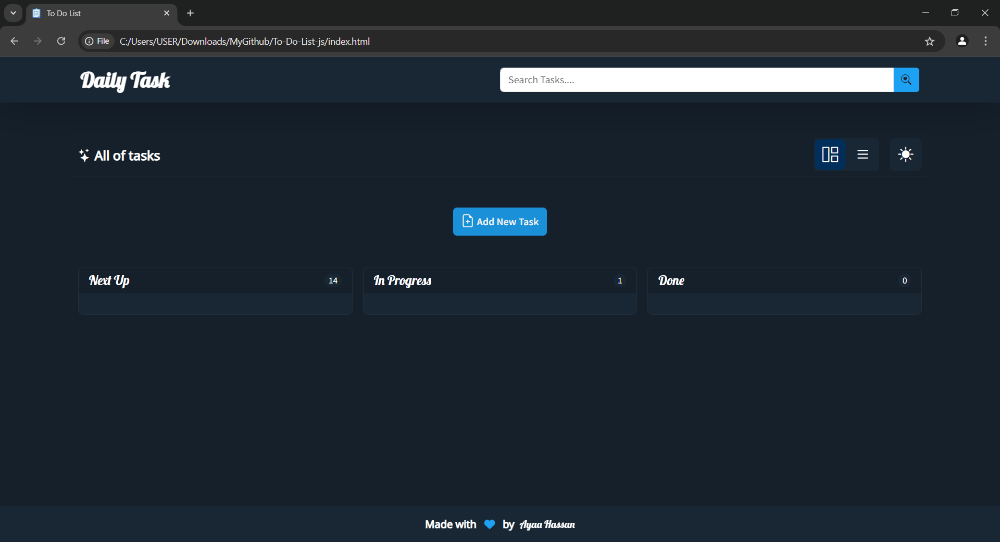
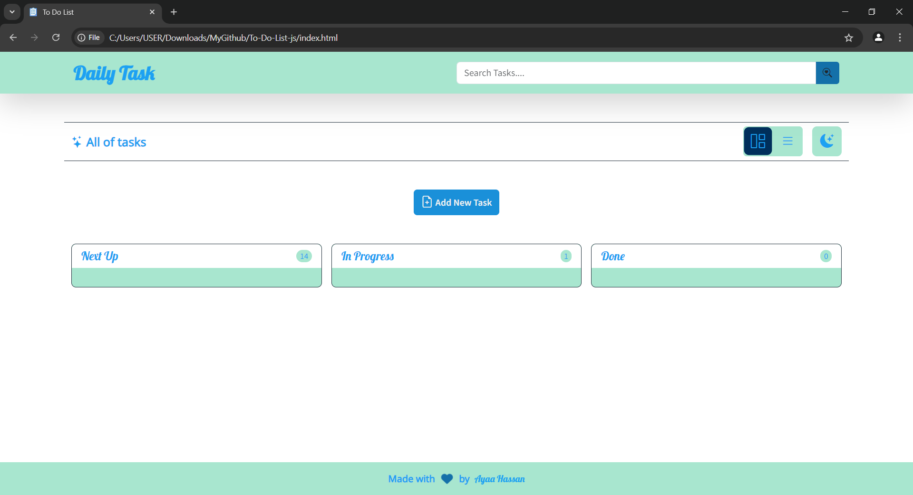
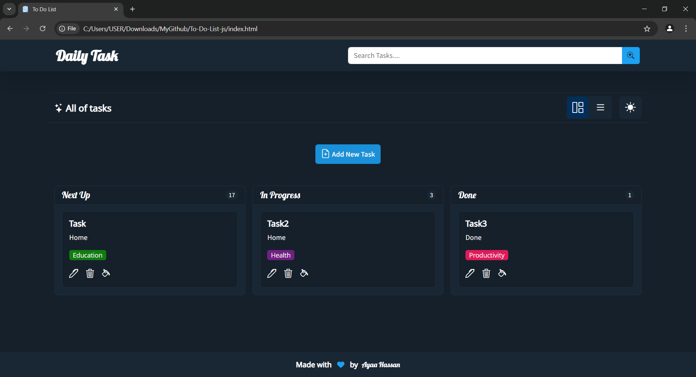

# To-Do-List-js
A simple to-do list made with HTML, CSS and JavaScript
Create a specific notes
Update a specific notes
Delete a specific notes
Search for a specific notes
Get all input values ​​and send them in JSON format
All entries must not be empty (verified)

Front-end technologies:
HTML5
CSS3
Javascript
Bootstrap
Bootstrap.icons library
Fontawesome library

 The site is fully responsive 

 
 
 

